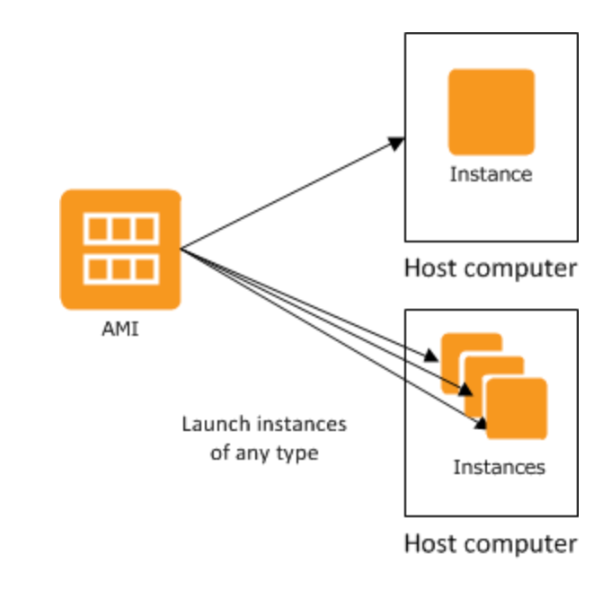

# EC2
> Amazon Web Services(AWS) 클라우드에서 온디맨드 확장 가능 컴퓨팅 용량을 제공

## 인스턴스
> 클라우드의 가상 서버
### 인스턴스
+ 하나의 AMI에서 다양한 인스턴스 유형을 실행가능
+ 인스턴스 유형에 따라 인스턴스에 사용되는 호스트 컴퓨터의 하드웨어가 기본적으로 결정됨
+ 각 인스턴스 유형은 서로 다른 컴퓨팅 및 메모리 기능을 제공
+ 인스턴스에서 실행하려는 애플리케이션 또는 소프트웨어에 필요한 메모리 양과 컴퓨팅 파워를 기준으로 인스턴스 유형을 선택
+ 인스턴스가 시작 후 다른 컴퓨터와 다를 것이 없고, 컴퓨터와 동일한 방식으로 작동
+ 인스턴스의 완벽한 통제가 가능 및 루트 권한이 필요한 명령은 sudo를 사용하여 실행 가능
### 인스턴스 유형
|     | Instance Family | Instance Genertation | Processor Family | Additional Capability | |Instance Size |
| --- | --------------- | -------------------- | ---------------- | --------------------- |---| ------------- |
| Ex  |c                |7                     |g                 |n                      |.|xlarge         |
#### 인스턴스 유형 명명 규칙
| Instance Family | 설명 | Processor Family | 설명 | Additional Capability | 설명 |
|---|---|---|---|---|---|
| C | 컴퓨팅 최적화 | a | AMD 프로세서 | d | 인스턴스 스토어 볼륨 |
| D | 고밀도 스토리지 | g | AWS Graviton 프로세서 | n | 네트워크 및 EBS 최적화 |
| F | FPGA | i | 인텔 프로세서 | z | 고성능 |
| G | 그래픽 집약적 |  |  | e | 추가 스토리지 또는 메모리 |
| Hpc | 고성능 컴퓨팅 |  |  | flex | Flex 인스턴스 |
| I | 스토리지 최적화 |  |  |  |  |
| Inf | AWS Inferentia |  |  |  |  |
| M | 범용 |  |  |  |  |
| Mac | macOS |  |  |  |  |
| P | GPU 가속 |  |  |  |  |
| R | 메모리 최적화 |  |  |  |  |
| T | 버스트 가능한 성능 |  |  |  |  |
| Trn | AWS Trainium |  |  |  |  |
| U | 고용량 메모리 |  |  |  |  |
| VT | 비디오 트랜스코딩 |  |  |  |  |
| X | 메모리 집약적 |  |  |  |  |

#### 범용 인스턴스
> 컴퓨팅, 메모리 및 네트워킹 리소스의 균형을 유지하는 범용 인스턴스는 광범위한 워크로드에 사용

인스턴스 종류 + 세대 | 설명 | 적합한 서비스
---|---|---
A1|Arm 에코시스템에서 지원하는 스케일 아웃 워크로드에 적합한 서비스| 웹 서버 컨테이너화된 마이크로서비스
### 시작 템플릿
### 스팟 요청
### Savings Plans
### 예약 인스턴스
### 전용 호스트
### 용량 예약

## 이미지
> Amazon Machine Image
### AMI
> 소프트웨어 구성이 기재된 템플릿   
> >`운영 체제`   
> >`애플리케이션 서버`   
> >`애플리케이션`

AMI에서 인스턴스를 바로 시작가능
(이 인스턴스는 AMI의 사본으로, 클라우드에서 실행되는 가상 서버)

### AMI 카탈로그

## EBS
### 볼륨
### 스냅샷
### 수명 주기 관리자

## 네트워크 및 보안
### 보안 그룹
### 탄력적 IP
### 배치 그룹
### 키 페어
### 네트워크 인터페이스

## 로드 밸런싱
### 로드밸런서
### 대상 그룹

## Auto Scaling 그룹
### Auto Scaling 그룹

<table>
    <td>내용</td>
    <td>내용</td>
</table>